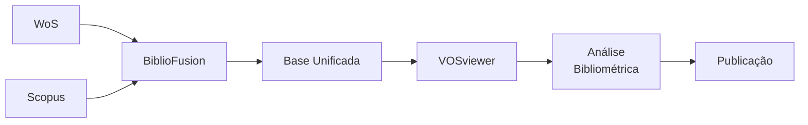

# 🚀 **BiblioFusion** - Fusão Bibliográfica Inteligente

 

## 📖 Sobre o Projeto

**BiblioFusion** é uma solução inteligente e automatizada para mesclar e preparar bases de dados bibliográficas da Web of Science e Scopus, otimizada para análise no VOSviewer. Transforma o caos de múltiplas bases em dados harmonizados e prontos para análise bibliométrica.

> *"Unindo bases, construindo conhecimento"*

## ✨ Características Principais

### 🔄 **Processamento Inteligente**
- ✅ Mesclagem automática Web of Science + Scopus
- ✅ Remoção inteligente de duplicatas
- ✅ Correção automática de formatos de data
- ✅ Padronização de campos para VOSviewer

### 🛡️ **Resolução de Problemas Comuns**
- 🎯 **Datas decimais:** Converte `2024.6` → `2024`
- 🔧 **Encoding:** Suporte completo a caracteres especiais
- 📊 **Valores missing:** Tratamento automático
- 🔍 **Formato inconsistente:** Padronização inteligente

### 📈 **Saída Otimizada**
- 🎯 Compatibilidade total com VOSviewer
- 📊 Relatórios detalhados de processamento
- 🔄 Preservação de metadados originais
- 🏷️ Identificação da fonte dos dados

## 🎯 Quick Start

### 1. **Instalação Rápida**
```bash
# Clone o repositório
git clone https://github.com/seu-usuario/bibliofusion.git
cd bibliofusion

# Instale as dependências
pip install pandas
```

### 2. **Uso Básico**
```bash
# Execute o BiblioFusion
python bibliofusion.py
```

### 3. **Saída Imediata**
```
🚀 INICIANDO BIBLIOFUSION v1.0
📥 Carregando bases de dados...
✅ Web of Science: 1.247 registros
✅ Scopus: 892 registros
🔄 Mesclando bases...
🎯 Removendo duplicatas: 156 registros removidos
📅 Corrigindo formatos de data...
💾 Salvando: bibliofusion_output.csv
🎉 PROCESSAMENTO CONCLUÍDO!
📊 Estatísticas finais: 1.983 registros únicos
```

## 📁 Estrutura do Projeto

```
bibliofusion/
├── 📄 bibliofusion.py                 # Script principal
├── 📁 inputs/                         # Pasta para arquivos de entrada
│   ├── wos_data.txt                  # Exportação Web of Science
│   └── scopus_data.csv               # Exportação Scopus
├── 📁 outputs/                       # Pasta para resultados
│   ├── bibliofusion_output.csv       # Base mesclada principal
│   └── processing_report.txt         # Relatório detalhado
├── 📁 docs/                         # Documentação
│   ├── MANUAL.md                    # Manual completo
│   └── TROUBLESHOOTING.md          # Solução de problemas
└── 📄 requirements.txt              # Dependências
```

## 🔧 Configuração Detalhada

### Pré-requisitos
- **Python 3.8+** - [Download aqui](https://www.python.org/downloads/)
- **Pandas** - `pip install pandas`
- **VOSviewer** - [Download oficial](https://www.vosviewer.com/)

### Preparação dos Arquivos de Entrada

#### Web of Science
1. Acesse Web of Science
2. Selecione os artigos desejados
3. Exporte como: **"Plain Text"** ou **"Tab-delimited"**
4. Salve como: `wos_data.txt`

#### Scopus
1. Acesse Scopus  
2. Selecione os artigos
3. Exporte como: **CSV**
4. Salve como: `scopus_data.csv`

### Execução Completa

```bash
# 1. Coloque os arquivos na pasta inputs/
cp caminho/do/seu/wos_data.txt inputs/
cp caminho/do/seu/scopus_data.csv inputs/

# 2. Execute o BiblioFusion
python bibliofusion.py

# 3. Verifique os resultados
ls outputs/
```

## 📊 Arquivos de Saída

### `bibliofusion_output.csv`
- Base principal mesclada e tratada
- Formato otimizado para VOSviewer
- Codificação: UTF-8 com BOM
- Campos padronizados

### `processing_report.txt`
```
RELATÓRIO BIBLIOFUSION
=====================
Data do processamento: 2024-12-15 14:30:25
Total de registros: 1.983
- Web of Science: 1.247 (62.9%)
- Scopus: 892 (45.0%)
Duplicatas removidas: 156
Período temporal: 2016-2024
Anos cobertos: [2016, 2017, 2018, 2019, 2020, 2021, 2022, 2023, 2024]
Arquivo gerado: bibliofusion_output.csv
Status: SUCESSO
```

## 🎮 Uso no VOSviewer

### Passo a Passo Simplificado

1. **Abra o VOSviewer**
2. **File** → **Create** → **Create a map based on bibliographic data**
3. **Selecione:** "Read data from reference manager files"
4. **Escolha:** `outputs/bibliofusion_output.csv`
5. **Mapeamento automático:**
   - `Title` → Title
   - `Authors` → Authors  
   - `Year` → Year
   - `Source title` → Source
   - `DOI` → DOI

### ⚡ Configuração Rápida VOSviewer

```python
# O BiblioFusion já prepara automaticamente:
# ✅ Campos no formato correto
# ✅ Datas como inteiros (2024, não 2024.6)
# ✅ Encoding compatível
# ✅ Estrutura otimizada
```

## 🔄 Fluxo de Trabalho Recomendado



## ⚙️ Personalização Avançada

### Modificar Campos de Saída

Edite no script principal:
```python
CAMPOS_PERSONALIZADOS = {
    'obrigatorios': ['Title', 'Authors', 'Year', 'Source title', 'DOI'],
    'opcionais': ['Abstract', 'Cited by', 'References', 'Keywords'],
    'metadados': ['Fonte', 'Processing_Date']
}
```

### Filtros Temporais

```python
# No script, modifique:
ANO_MINIMO = 2010
ANO_MAXIMO = 2024
```

## 🐛 Solução de Problemas

### Problemas Comuns e Soluções

| Problema | Sintoma | Solução |
|----------|---------|---------|
| **Arquivos não encontrados** | Erro de file not found | Verifique pasta `inputs/` |
| **Encoding errors** | Caracteres especiais quebrados | Use UTF-8 no export |
| **Datas com decimais** | 2024.6 no VOSviewer | Execute BiblioFusion novamente |
| **Duplicatas persistentes** | Registros repetidos | Verifique campos DOI/Title |

### Logs de Depuração

```bash
# Execute em modo verbose
python bibliofusion.py --verbose

# Ou para debug detalhado
python bibliofusion.py --debug
```

## 📈 Exemplos de Uso

### Caso 1: Revisão Sistemática
```bash
# Para uma revisão sobre "machine learning"
python bibliofusion.py
# Output: 2.341 artigos únicos, 2010-2024
```

### Caso 2: Análise Bibliométrica
```bash
# Para análise de tendências
python bibliofusion.py --min-year 2015 --max-year 2024
# Output: Foco em publicações recentes
```

## 🤝 Contribuindo

### Reportando Issues
1. Verifique se o problema já foi reportado
2. Inclua mensagens de erro completas
3. Anexe exemplos dos arquivos de entrada

### Sugerindo Melhorias
- Novos formatos de exportação
- Processamento em lote
- Interface gráfica

## 📄 Licença

Este projeto está licenciado sob a Licença MIT - veja o arquivo [LICENSE](LICENSE) para detalhes.

## 🏆 Citação

Se usar o BiblioFusion em sua pesquisa, cite:

```bibtex
@software{bibliofusion2024,
  title = {BiblioFusion: Fusão Bibliográfica Inteligente},
  author = {Seu Nome},
  year = {2024},
  url = {https://github.com/seu-usuario/bibliofusion}
}

```
